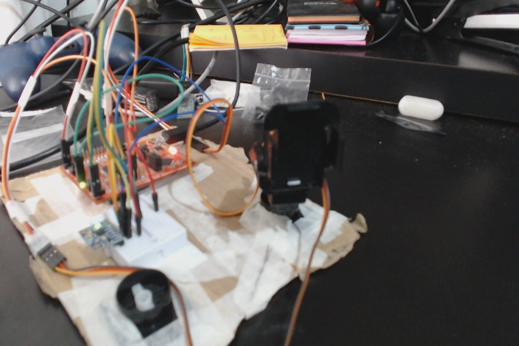

<!-- -->
# Plataforma Inercial - Galinha

***este Markdown está meio zuado, veja o pdf**
**\_\_\_\_\_\_\_\_\_\_\_\_\_\_\_\_\_\_\_\_\_\_\_\_\_\_\_\_\_\_\_\_\_\_\_\_\_\_\_\_\_\_\_\_\_\_\_\_\_\_\_\_\_\_\_\_\_\_\_\_\_\_\_\_\_\_\_\_\_\_\_\_\_\_\_\_\_\_\_\_\_\_\_\_\_**

_**Resumo:** Este relatório apresenta a implementação de uma plataforma inercial, também conhecida como "A Galinha", controlada pela LaunchPad MPS430F5529 que por meio do giroscópio/acelerômetro MPU6050 mensura a perturbação do meio e realiza uma compensação por meio do controle de servos MG90. Foram implementadas as rotinas para compensação por meio de integração do giroscópio e por meio dos dados de aceleração_

## **Introdução**

Diversos sistemas dinâmicos em carros, drones, aviões, entre outros dependem da obtenção de dados de posicionamento angular. O giroscópio/acelerômetro é um instrumento muito popular para este propósito. O princípio físico destes dispositivos é relativamente simples, o giroscópio mede a velocidade de rotação e o acelerômetro mede a aceleração em que a gravidade está contribuindo para aquele eixo.Neste trabalho, é empregado o sensor MPU6050 que é um giroscópio com 3 eixos (x,y,x) e um acelerômetro com 3 eixos (x,y,z). Com isso podemos obter os dados de deslocamento angular de duas formas:

- Pelo giroscópio (Integração da velocidade angular)
- Pelo acelerômetro.

Ao final realizaremos uma análise sobre ambos os casos com os pontos negativos e positivos de cada forma de obter estes dados. Ademais, para poder realizar a plataforma, além do MPU6050, precisamos de uma plataforma _Pan Tilt_ e de servos motores comuns que tem acionamento por meio de pulsos modulados em largura, neste projeto utilizamos o servo motor MG90 e a LaunchPad com o MSP430F5529. **O servo SG90 não apresentou desempenho estável, por isto foi substituído pelo MG90.**

  

    
  

  

    
  

_Figure 1: Visão superior lateral da plataforma implementada. No canto superior esquerdo da figura à esquerda, temos o servo MG90 que foi utilizado nos ensaios, o servo do canto inferior esquerdo é o sg90 que não apresentou um desempenho satisfatório nos ensaios. Podemos ver o MPU6050 ao centro, na protoboard e a LaunchPad, que é a placa em vermelho._

Agora será feito uma breve contextualização dos recursos utilizados da LaunchPad para controle e acionamento de cada periférico adicionado.

**Universal Serial Communication Interface USCI** Esta unidade é utilizada para configurar e obter os dados do MPU6050 por meio do protocolo de comunicação I2C. Esta unidade pode ser configurada para atender a diversos protocolos de comunicação serial, sendo um deles, o protocolo I2C. Portanto essa unidade é utilizada para configurar e para ler os dados do MPU6050. Na próxima seção deste relatório serão apresentadas as configurações que esta unidade realiza no MPU6050.

**Temporizadores (Timers)** Os timers possuem diversas utilizações dentro deste projeto. Notadamente, podemos destacar duas aplicações específicas e notórias, essenciais para o projeto.

- Geração de pulsos modulados em largura (PWM) para controle dos servos.

Servos são sistemas realimentados de controle de motor por posição que utilizam largura de pulso. Podemos, por meio da modulação da largura de um pulso, controlar a posição angular do eixo do motor do servo. Esse recurso é desempenhado pelos timers. O MSP430F5529LP permite configurar unidades do timer de diversos modos e para diversos propósitos, sendo um deles a geração de PWM. Neste projeto, iremos precisar de duas unidades de comparação de um timer configurado para a frequência de operação do MG90.

- Cronometragem do tempo para realização de integração de velocidade angular.

O recurso dos timers possibilita a mensuração temporal precisa. Esse recurso foi utilizado em uma aplicação específica que será explicada nas seções a seguir. O que é relevante compreender é a possibilidade de mensurar o tempo para que possa ser utilizado num método de integração, isso foi utilizado no projeto para obtenção do deslocamento angular por meio da velocidade angular.

1. **Configuração do**  **MPU6050**

Este componente possui uma vasta quantidade de registradores para uma configuração realmente customizada para as condições de projeto. Aqui será discutido um pouco sobre os principais registradores e como seus parâmetros são configurados.

1. Configurar filtro passa baixa, registrador CONFIG (0x1A).

O filtro passa baixa (FPB) é utilizado para atenuar os ruídos, e consequentemente o erro, em medições pontuais. Caso existam ruídos em frequências espúrias, estas podem causar uma interferência na medição cuja consequência direta no projeto é a trepidação dos servos. Para tanto, o MPU6050 possui um FPB configurável. Interessante notar que isso será mais importante na configuração pelo acelerômetro, uma vez que a integração oferece naturalmente um amortecimento que pode ser interpretado como um filtro passa baixa.

_Tabela 1: Registrador CONFIG (0x1A) configurado para 6_

|  			-- 		 |  			-- 		 |  			EXT_SYNC_SET[2-0] 		 |  			DLPF_CFG[2-0] 		 |
|------|------|---------------------|-----------------|
|  			0 		  |  			0 		  |  			0 		                 |  			6 		             |

1. Configurar a taxa de amostragem, registrador SMPLRT\_DIV (0x19)

A taxa de amostragem é fixa em 1KHz, por meio de _subsampling_, há um registrador que permite configurar a divisão desta taxa. Neste trabalho em específico utilizamos uma amostragem a cada 7ms.

_Tabela 2 Registrador SMPLRT\_DIV (0x19) configurado para divisão da taxa de amostragem por 1+6=7 ms (de 7 em 7 ms, uma amostragem)._

| SMPLRT\_DIV[7:0] |
| --- |
| 6 |

1. Configurar escala do giroscópio GYRO\_CONFIG (0x1B)

Agora temos que configurar a escala o giroscópio. Existem as configurações para: +-250 graus/s, +-500 graus/s, +-1000 graus/s e +-2000 graus/s. É evidente que quanto maior for a escala, maior será a precisão da grandeza. Todavia há um trade-off: quanto maior a escala, maior será a quantidade de contas para serem realizadas visto maiores números, em contraponto, quanto maior é a escala, mais tempo de medição é gasto aumentando ainda mais tempo de processamento. Neste projeto, foi optado pela maior precisão visto que o projetista julgou que o tempo é algo a ser menos considerado quando comparado com a precisão das medições.

_Tabela 3 Registrador GYRO\_CONFIG (0X1B), configurado para escala de +-2000graus/s._

| _-_ | _-_ | _-_ | _FS\_SEL[1-0]_ | _-_ | _-_ | _-_ |
| --- | --- | --- | --- | --- | --- | --- |
| _0_ | _0_ | _0_ | _1 1_ | _0_ | _0_ | _0_ |

1. Configurar escala do giroscópio ACCEL\_CONFIG (0x1C)

O mesmo é feito para uma escala, agora do acelerômetro. Tendo as medições normalizadas pela constante gravitacional g=9.8m/s². Há as seguintes configurações possíveis para escala do acelerômetro. +-2 g, +-4 g, +-8 g e +- 16 g. Foi adotado o mesmo critério de resolução: quanto maior, melhor, e foi escolhida 16 g para escala do acelerômetro.

_Tabela 4 Registrador ACCEL\_CONFIG (0X1C), configurado para escala de +-16g._

| - | - | - | FS\_SEL[1-0] | - | - | - |
| --- | --- | --- | --- | --- | --- | --- |
| 0 | 0 | 0 | 1 1 | 0 | 0 | 0 |

1. Configuração do pino de interrupção, registrador INT\_PIN\_CFG (0x37)

Para sinalizar a existência dados novos ainda não acessados, o MPU6050 possui um pino chamado INT. Em que int provavelmente deve significar a abreviação de interrupção. Contudo, aqui não será utilizado essa interrupção; o registrador INT\_PIN\_CFG possui uma configuração, dentro das possíveis de, a cada dado novo, INT levado ao nível alto e assim permanecerá por 50 us. Dessa forma, não é necessário ler cada dado novo para que o algoritmo siga.

_Tabela 5 Registrador INT\_PIN\_CFG (0x37). Configura o pino INT: ativo em nível alto por 50 us, após 50 us o INT é automaticamente resetado e recomeça amostragem._

| INT\_LEVEL | INT\_OPEN | LATCH\_INT\_EN | INT\_RD\_CLEAR | X | X | X | X |
| --- | --- | --- | --- | --- | --- | --- | --- |
| 0 | 0 | 1 | 1 | 0 | 1 | 1 | 1 |

Assim é terminada a explicação dos principais registradores do MPU6050. Próxima seção será dedicada a metodologia, incluindo formas de se interpretar os dados do MPU6050, acionamento dos servos e funcionamento do programa.

## **Método**

Esta seção tem como objetivo mostrar/discutir/explicar os procedimentos preliminares feitos para configuração do sistema; a forma como os dados foram amostrados e interpretados nos sinais de saída do PWM e a motivação por trás das tomadas de decisão de projeto. **O ponto fundamental é: temos que descobrir qual foi o deslocamento angular.** Com isso é possível acionar os servos para atuarem de forma a compensar o deslocamento, por isso, passaremos agora para discussão sobre como obter os dados de deslocamento com o MPU6050.

### **Calibração.**

A calibração é um procedimento muito necessário para o bom funcionamento do sistema. Estes dispositivos, sensores CMOS, possuem uma irregularidade entre si, cada sensor fabricado tem uma tendencia regular de apontar uma determinada quantidade de unidades a mais para um ponto que outro, ou seja, são tendenciosos. A calibração é um processo que tenta resolver este problema executando uma quantidade razoável de medições e estabelecendo um valor médio para usar como offset de cada eixo. Assim, este procedimento é executado no início do algoritmo e o sistema deve permanecer o máximo estável possível para que a calibração seja a mais precisa possível.

### **Medição valores do giroscópio.**

De forma resumida este procedimento. Primeiro deve-se uma explicação do recurso de temporização do timer: um timer foi configurado para operar no _modo-up_ com a interrupção habilitada, programado para interromper sempre a cada 1 milissegundo. Portanto a cada milissegundo temos uma rotina de interrupção sendo executada. Vejamos o fluxograma da interrupção e da rotina.

  

_Figure 2 Este é o fluxograma simplificado da leitura e processamento para determinação do deslocamento angular pelo giroscópio._

Nesta rotina, há um contador que é zerado a cada medição e processamento do MPU6050, logo, a cada medição do MPU temos o tempo em milissegundo que demorou de um dado para outro, e consequentemente, fazendo a multiplicação disso pelos valores de constante configurados na escala obtemos o deslocamento que é acumulado em uma variável ao decorrer da execução do algoritmo.

Na figura 2, há um processo que inclui calcular o deslocamento, que é feito em dois passos essenciais, primeiro convertemos o dado obtido do MPU6050 para escala de graus/sec e, para isso, lembramos que a constante do giroscópio estava configurada para 2000graus/sec.

Esta é a constante para converter o dado com a resolução configurada. O valor de deslocamento obtido cada medição é

Lembrando que esse offset é obtido por uma média de medições na calibração. Gw é a velocidade angular, precisamos é do deslocamento.

E o deslocamento total do ângulo é:

Assim é concluído a explicação sobre a forma de obtenção do deslocamento angular pelo giroscópio utilizando integração de velocidade angular.

### **Medição valores do acelerômetro.**

O método do acelerômetro é mais simples.É necessário apenas realizar a leitura e a conversão. A dinâmica de leitura permanece a mesma, redundante seria explicar novamente.

  

_Figure 3 Este é o fluxograma simplificado da leitura e processamento para determinação do deslocamento angular pelo acelerômetro._

Resta nesta parte colocar determinar as constantes para o deslocamento. Como mostramos, configuramos a escala do acelerômetro para operar nos 16 g.

Com esta conversão, o processo é análogo ao giroscópio.

O valor Agrav será entre -1 e 1. Quando ele for -1, terá um valor de -90 graus; e 1, 90 graus assim, não é necessário acumular estes valores e por isso, este método da aceleração é menos susceptível ao erro acumulado pelo tempo.

Assim temos o valor em ângulos do deslocamento das perturbações. Não está colocado no fluxograma, todavia o **valor que é de fato fornecido ao servo é em função de uma média de 10 medições anteriores.** O método da integração é naturalmente amortecido, evidentemente, por ser uma integração, mas para aceleração esses dados devem ser tratados para evitar trepidação.

###  **Dinâmica da plataforma**

Vamos explicar aqui como que a plataforma funciona. Para melhor e mais flexível utilização dos recursos do MPU6050, neste projeto é proposto o seguinte esquema:

_Figure 4 Configuração da plataforma é feita casando o índice do vetor de dados com valor do contador._

Os valores obtidos a partir do processamento descrito nas seções anteriores estão dispostos num **vetor de dados** indexados de cima para baixo como está disposto na figura acima. Paralelamente, as chaves da LaunchPad, quando acionadas, incrementam um contador que corresponderá à indexação da chave. Assim podemos selecionar, por meio das chaves, qual configuração possível atribuída para cada servo.

_Figure 5 Na LauchPad, a chave S1 seleciona o servo da base e a chave S2 seleciona o servo do topo._

### **Controle dos servos.**

Vimos nas seções anteriores como obter o deslocamento angular. Agora será mostrado como controlamos os servos para corresponderem aos deslocamentos amostrados.

Os servos utilizados têm a característica limitante de excursionar 180 graus. Podemos relacionar isto da forma como convier. Aqui estabelecemos uma convenção: o valor mínimo é -90 graus e o máximo +90 graus. Inicialmente o servo fica configurado para 0 graus.

_Figure 6 posicionamento do servo depende da modulação PWM. Esta figura mostra os valores convencionados para este trabalho e o valor teórico fornecido pelo fabricante do servo do duty cycle que deveriam operar_

Na figura acima podemos ver: o posicionamento em graus convencionados para este projeto. Abaixo da medida em graus está o tempo de _duty cycle_ necessário para que o servo fique nesta posição tendo o período é de 50 Hz. Além disso, o timer é configurado com o SMCLK. **Esses valores são teóricos e tiveram que ser ajustados**. Com muita paciência e determinação foi traçada a curva de tempo de ciclo para posição angular de forma **empírica.** Segue abaixo a relação do deslocamento de ângulo (theta) com as instanciações do timer.

## **Verificações/Resultados.**

Nesta presente seção, serão apresentadas algumas verificações para o projeto da galinha. A intenção é mostrar que o que foi discutido na configuração do MPU6050 e na metodologia correspondem à prática.

- Verificar a taxa de amostragem.

Primeiramente, será mensurado a taxa de atualização do MPU6050 que foi programado para uma amostragem a cada 7 ms. Isso pode ser verificado por meio do sinal do pino INT do MPU6050 que indica um novo dado sempre quando sai do nível baixo para alto.

_Figure 7 Osciloscópio está medindo o pino INT do MPU6050. Os marcadores (texto em branco) mostra que é feita uma medição a cada 7 ms, como foi configurado no registrador SMPRLT\_DIV=6, pois adiciona-se um, logo uma amostragem a cada 6 ms+1 ms._

- Verificar o funcionamento do servo do topo com servo da base parado

Agora iremos verificar o correto funcionamento do servo. A forma mais simples que para verificar seria deixar o valor constante da curva do servo correspondendo ao alinhamento deste servo com a altura Eq(2). No servo do topo, não é necessariamente simétrica a relação, a excursão é limitada mecanicamente e a forma de obter as curvas é diferente e depende menos da inclinação que, ainda bem, é mais regular para todos os servos. Isso foi feito de forma empírica:

    

_Figure 8 **Ensaio com o eixo Y para o servo do topo,** vemos que o do topo está ortogonal com relação à mesa. Esta é a condição inicial deste ensaio._

  

    
  

  

    
  

_Figure 9 **Ensaio com o eixo Y para o servo do topo** ; figura à esquerda convencionamos como inclinação positiva, perceba que o topo da plataforma mantém a orientação ortogonal à mesa. A figura à direita é quando inclinamos para baixo, convencionamos de inclinação negativa, vemos que o servo desempenhou corretamente a compensação e o topo da plataforma está ortogonal à superfície da mesa em ambas figuras._

**Obs:** este ensaio foi realizado utilizando o método de integração com eixo Y do MPU6050.

- Verificar o funcionamento do servo da base com o topo parado.

Para ser mais fácil visualizar este comportamento, o mais fácil de visualizar seria com o eixo Z. Todavia, este eixo não é eficiente quando utilizamos o acelerômetro, portanto, iremos utilizar o método de integração de velocidade angular obtido pelo giroscópio.

_Figure **10 Ensaio com o eixo Z para o servo da base** ; esta é a posição inicial, a direção apontada que deve ser compensada está ortogonal ao topo (peça preta onde seria a cabeça da galinha) da plataforma._

  

    
  

  

    
  

_Figure 11 **Ensaio com o eixo Z para o servo da base;** veja que a figura à esquerda, com relação à figura base, sofreu uma rotação no sentido horário, logo o servo corresponde isso realizando uma rotação no sentido anti-horário. O inverso acontece com a figura à direita: a base sofre uma rotação no sentido anti-horário e o servo corresponde com uma rotação no sentido horário._

Estes testes realizados em separado verificam o correto funcionamento, uma vez que foi testado que os dois são corretamente acionados em conjunto. Verificar o comportamento do servo ao mesmo tempo em duas posições é demasiado laborioso e exige mais de uma pessoa para segurar/tirar foto e manter a plataforma estável.

**Obs:** as figuras deste ensaio foram capturadas por uma câmera que estava fixa em um pedestal, as imagens podem estar parecer terem ângulos diferentes com relação à mesa, mas isto é devido à edição das imagens.

**Conclusão.**

O projeto foi concluído com sucesso, importante **deixar registrado que o esqueleto do algoritmo utilizado foi obtido no capítulo de I2C do livro da disciplina.**

- **Na proposta disse que o HC05 era facultativo**. Não o utilizei, não havia necessidade, incrementaria nada de relevante ao projeto. O que foi feito de forma adicional foi o controle pelas chaves S1 e S2 da entrada dos servos.

